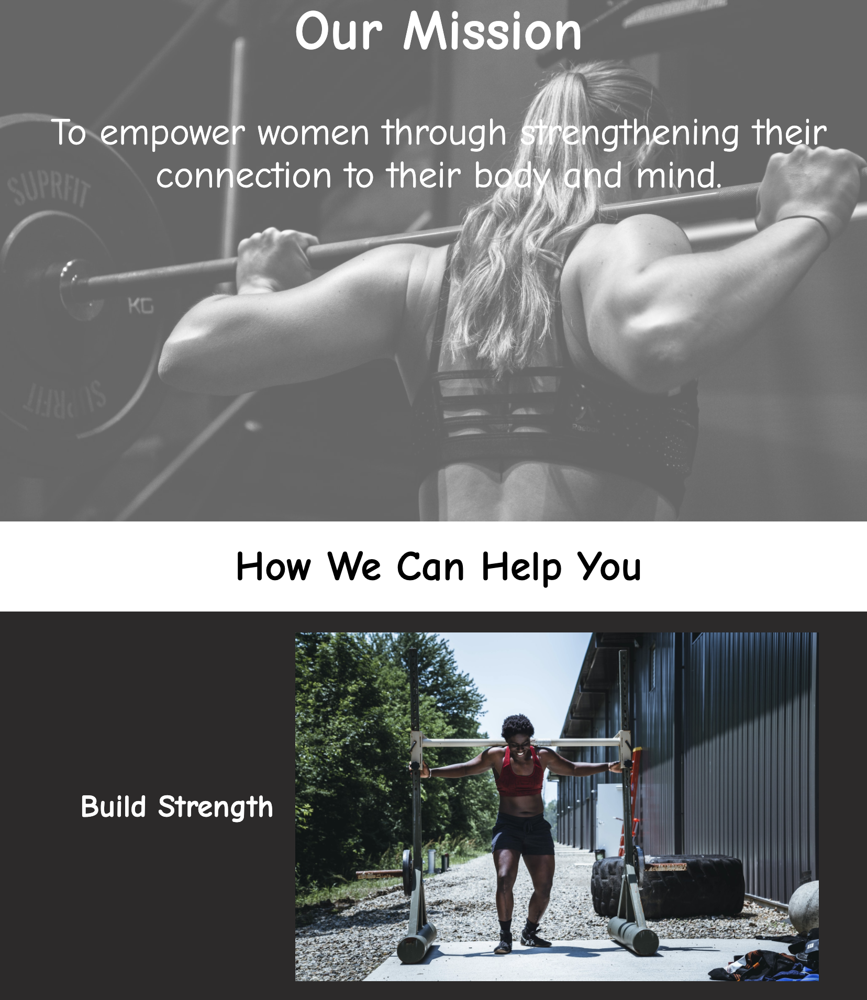

# Project Name
> Company Home Page with Flexbox (Codecademy Project)

## Table of contents
* [Project Goals](#project-goals)
* [Project Requirements](#project-requirements)
* [Screenshots](#screenshots)
* [Technologies](#technologies)
* [Setup](#setup)
* [Status](#status)
* [Inspiration](#inspiration)
* [Contact](#contact)

## Project Goals (from Codecademy)
In this project, you’ll be using flexbox to design and build the layout for a company’s homepage. You can choose to build a new homepage for an existing company or imagine your own dream company!​

## Project Requirements (from Codecademy)

1. You’re going to build a company homepage for a real or imagined company. You’ll get to decide exactly what content to include for this company, but you should at least include:

* A title and logo or splash image.
* A mission statement or brief description of the company.
* A list or set of images and titles representing the product or products of the company.
* A section describing some of the company’s employees or teammates.

If you want, you can tour our example site for inspiration or to see how we used flexbox. Your site will probably look very different from ours, and that’s great!

2. Your project should use flexbox styling for layout. Aim to use flexbox’s advantages, such as easy horizontal and vertical positioning, flexible element flows as the page size changes, and great styling for repeated elements.

In our example project, we used flexbox to:

* Create a centered navbar at the top of the page.
* Create a flexible display of company products that changes from a more grid-like list to a column list as the page shrinks.
* Create a flexible display of company employees.

Our example site is not an elaborate use of flexbox–we’re sure you can come up with other uses of flexbox in your layout, such as taking advantage of flex-grow or flex-shrink.

3. Your page should also use custom styles for other properties, such as colors, fonts, and other layout properties such as borders and padding.

Our example site uses:

* A simple color scheme using CSS named colors, but yours can be more elaborate with hexadecimal, RGB, or HSL colors.
* Fonts from the Google Fonts API.
* Custom images. A great source for project images when you’re practicing web design is Unsplash.

Get creative! Customizing your site’s look and feel is one of the most exciting parts of building your own websites. You can review any of these other CSS properties in our Learn CSS course.

## Screenshots


## Technologies
* HTML5
* CSS3

## Setup
Download zip files from GitHub and open index.html file in local browser to view webpage.

## Code Examples
```css
/*** About Us Section ***/

#about {
    display: flex;
    flex-wrap: wrap;
    justify-content: center;
    align-content: center;
    justify-items: center;
    align-items: center;
    background-color: rgb(44, 42, 42);
    color: white;
}
```

## Status
Project is: _completed on_ 1/12/2021.

## Inspiration
Project provided by Codecademy in Making a Website Responsive module after covering the following topics:
* Responsive Design
* Layout with Flexbox
* Grids and Spacing

## Contact
Created by Claudia de Lima [@claugia13](https://github.com/claugia13) - feel free to contact me!